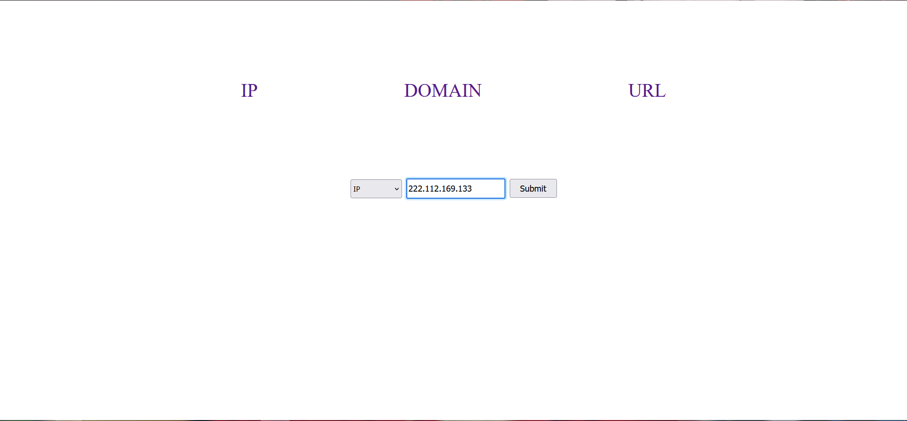

# Taxii-Stix-Web-v1

### Till now 
1. Fetching the data from HailATaxii server. Logging the number of IP, Domain, URL count received from server.
2. Organizing the data and storing them in MapDB.
3. From the webpage, we can separately request for URL, DOMAIN, IP. These are processed from saved MapDB.
4. To search for a specific IP, DOMAIN, URL. Use the search box.

------------------

### TODO

- [x] " "

--------------------

### To Run
1. Build the Project with Maven Build tool
2. War file is generated in "target/" directory. Run it
   
<code>java -jar "filename.war"</code> 

####
3. END POINT :
   - /ips : to fetch ips
   - /domains : to fetch domains
   - /urls : to fetch urls

--------------------

